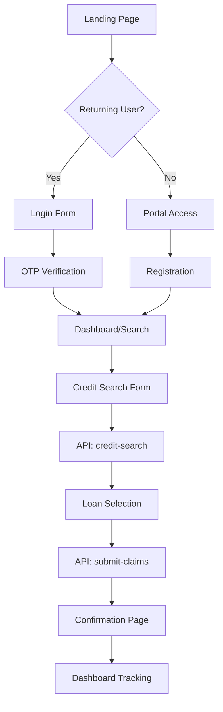

# PROJECT OVERVIEW - CML Car Finance

## Executive Summary

CML Car Finance is a comprehensive Next.js 14 application designed to help customers submit and track car finance mis-selling claims. The platform provides a seamless user experience from initial credit assessment through claim submission and ongoing status tracking. Built with modern web technologies and deployed on Netlify, the application features secure OTP-based authentication, multi-step forms with real-time validation, and integration with external services including Zoho CRM for backend processing.

The application serves two primary user groups: customers seeking to submit car finance claims and administrators managing the claim process. It offers a fully responsive design with a professional UI built on shadcn/ui components, ensuring accessibility and consistent user experience across all devices.

## Architecture

### System Architecture Overview

The application follows a **serverless JAMstack architecture** with clear separation of concerns:

```
┌─────────────────────────────────────────────────────┐
│                   CLIENT TIER                       │
│  Next.js 14 App Router + React 18 + TypeScript     │
│  - Server-side rendering for SEO                    │
│  - Client-side interactivity                        │
│  - shadcn/ui component library                      │
└─────────────────────────────────────────────────────┘
                           │
                    API Gateway
                           │
┌─────────────────────────────────────────────────────┐
│                 SERVERLESS TIER                     │
│         Netlify Functions (Node.js)                 │
│  - Business logic isolation                         │
│  - API endpoint management                          │
│  - Third-party integrations                         │
└─────────────────────────────────────────────────────┘
                           │
                   External Services
                           │
┌─────────────────────────────────────────────────────┐
│                 EXTERNAL APIS                       │
│  - Zoho Creator (CRM & Data Management)            │
│  - Address Lookup Services                          │
│  - OTP/SMS Services                                 │
└─────────────────────────────────────────────────────┘
```

### Key Architectural Decisions

1. **Next.js App Router**: Leverages the latest Next.js 14 features for improved performance and developer experience
2. **Serverless Functions**: All backend logic isolated in Netlify Functions for scalability and maintainability
3. **Client-Side Session Management**: Lightweight session handling via localStorage with 30-minute expiration
4. **Component-Based Architecture**: Modular, reusable components following atomic design principles
5. **TypeScript Throughout**: Strong typing for improved code quality and developer productivity
6. **No Global State Management**: Simplified architecture using React's built-in state management

## Tech Stack

### Frontend Technologies

- **Framework**: Next.js 14.1.0 (App Router)
- **Language**: TypeScript 5.x
- **UI Library**: React 18.2.0
- **Styling**:
  - Tailwind CSS 3.4.x
  - CSS Modules for component-specific styles
  - shadcn/ui components built on Radix UI primitives
- **Form Management**:
  - React Hook Form (latest)
  - Zod validation (latest)
- **UI Components**:
  - Radix UI (comprehensive suite of 30+ components)
  - Lucide React icons
  - Custom components with Class Variance Authority (CVA)
- **Date Handling**: date-fns (latest)
- **HTTP Client**: Axios 1.6.7
- **Charts**: Recharts 2.15.0

### Backend Technologies

- **Runtime**: Node.js (via Netlify Functions)
- **Serverless Platform**: Netlify Functions with ESBuild bundler
- **API Integration**: RESTful APIs with CORS support
- **External Services**:
  - Zoho Creator API (EU region)
  - Postcode/Address lookup services
  - OTP/SMS verification services

### Development Tools

- **Package Manager**: npm
- **Build Tool**: Next.js build system
- **Local Development**: Netlify CLI 20.1.1
- **Code Quality**:
  - ESLint (configured but warnings ignored in production)
  - TypeScript strict mode
- **Version Control**: Git

### Deployment & Infrastructure

- **Hosting**: Netlify
- **Build Command**: `npm run build`
- **Functions**: Netlify Functions (AWS Lambda under the hood)
- **CDN**: Netlify Edge Network
- **Environment Variables**: Managed via Netlify dashboard

## Directory Structure

```
cml-car-finance/
├── app/                        # Next.js App Router pages
│   ├── page.tsx               # Home page with login
│   ├── layout.tsx             # Root layout with providers
│   ├── globals.css            # Global styles
│   ├── admin/                 # Admin portal
│   ├── confirmation/          # Claim confirmation page
│   ├── dashboard/             # User claim dashboard
│   ├── loans/                 # Loan selection interface
│   ├── login/                 # Standalone login page
│   ├── portal-access/         # New user registration
│   └── search/                # Credit search form
│
├── components/                 # React components
│   ├── ui/                    # shadcn/ui components (53 files)
│   │   ├── button.tsx
│   │   ├── card.tsx
│   │   ├── form.tsx
│   │   ├── input.tsx
│   │   └── ... (49 more)
│   ├── credit-search-form.tsx # Main search form
│   ├── login-form.tsx         # Authentication form
│   ├── car-loans-selection.tsx# Loan selection logic
│   ├── claims-dashboard.tsx   # Dashboard display
│   └── ... (other components)
│
├── netlify/
│   └── functions/             # Serverless API endpoints
│       ├── admin-login.js     # Admin authentication
│       ├── credit-search.js   # Credit search API
│       ├── get-claims.js      # Retrieve claim data
│       ├── portal-signup.js   # User registration
│       ├── send-otp.js        # OTP generation
│       ├── verify-otp.js      # OTP verification
│       ├── submit-claims.js   # Claim submission
│       └── ... (more functions)
│
├── utils/                     # Utility functions
│   └── session.ts            # Session management
│
├── lib/                      # Shared libraries
│   └── utils.ts             # Common utilities
│
├── docs/                     # Documentation
│   ├── development-guidelines.md
│   ├── netlify-cors-guide.md
│   └── claims-dashboard-prd.md
│
├── scripts/                  # Development scripts
│   ├── start-dev.zsh        # Dev server startup
│   ├── reset-node.zsh       # Node modules reset
│   └── git-push.zsh         # Git workflow
│
├── public/                   # Static assets
│   └── (images, fonts, etc.)
│
├── styles/                   # Additional styles
├── package.json             # Dependencies
├── next.config.mjs          # Next.js configuration
├── netlify.toml             # Netlify configuration
├── tsconfig.json            # TypeScript configuration
├── tailwind.config.ts       # Tailwind configuration
└── CLAUDE.md                # AI assistant instructions
```

## Core Components

### Page Components

1. **Home Page** (`app/page.tsx`)
   - Landing page with conditional messaging
   - Embedded login form for returning users
   - Marketing content and call-to-action

2. **Search Page** (`app/search/page.tsx`)
   - Comprehensive credit search form
   - Multi-step data collection process
   - Real-time validation and address lookup

3. **Loans Page** (`app/loans/page.tsx`)
   - Display eligible car loans based on search results
   - Multi-selection interface with business rules
   - Date cutoff validation (claims before April 2021)

4. **Dashboard** (`app/dashboard/page.tsx`)
   - User portal showing claim status
   - Progress tracking and potential compensation display
   - Session-protected with automatic refresh

5. **Admin Portal** (`app/admin/page.tsx`)
   - Administrative login with enhanced security
   - Separate authentication flow from user portal

### Form Components

1. **CreditSearchForm** (`components/credit-search-form.tsx`)
   - **Features**: 31-field comprehensive form with 5 logical sections
   - **Validation**: Zod schema with complex business rules
   - **Integration**: Postcode lookup, date validation, conditional fields
   - **State Management**: React Hook Form with controlled inputs

2. **LoginForm** (`components/login-form.tsx`)
   - **Two-step authentication**: Email/Mobile → OTP verification
   - **Session handling**: 30-minute expiration with automatic renewal
   - **Error handling**: Comprehensive user feedback

3. **CarLoansSelection** (`components/car-loans-selection.tsx`)
   - **Business logic**: Date filtering, eligibility checking
   - **Multi-selection**: Checkbox interface with select-all functionality
   - **Data persistence**: localStorage for form continuity

### UI Component Library

The application uses **53 shadcn/ui components** including:
- **Forms**: Input, Select, Checkbox, Radio, DatePicker
- **Layout**: Card, Dialog, Sheet, Tabs
- **Navigation**: Menu, Breadcrumb, Command palette
- **Feedback**: Toast, Alert, Progress indicators
- **Data Display**: Table, Badge, Avatar

### Utility Modules

1. **Session Management** (`utils/session.ts`)
   - Token-based authentication
   - Automatic expiration and renewal
   - Protected route helpers
   - Bearer token generation for API calls

2. **Common Utilities** (`lib/utils.ts`)
   - Class name merging (cn function)
   - Type helpers
   - Shared constants

## Data Flow

### User Journey Flow



### Authentication Flow

1. **Initial Login**
   - User enters email/mobile
   - System sends OTP via `send-otp` function
   - User enters OTP code
   - System verifies via `verify-otp` function
   - Session created with token and 30-minute expiration

2. **Session Management**
   - Token stored in localStorage
   - Automatic renewal on activity
   - Protected routes check authentication status
   - Expired sessions redirect to login

### Form Submission Flow

1. **Data Collection**
   - Multi-step form with client-side validation
   - Real-time field validation with Zod
   - Address lookup integration
   - Progress saved to localStorage

2. **API Submission**
   - Data serialized to JSON
   - Sent to Netlify Function endpoint
   - Function proxies to Zoho Creator API
   - Response handled with error management

3. **State Persistence**
   - Search results stored in localStorage
   - Used for loan selection page
   - Cleared after successful submission

## API Documentation

### Netlify Functions Endpoints

All endpoints follow the pattern: `/.netlify/functions/[function-name]`

#### Authentication Endpoints

1. **POST `/send-otp`**
   - Generates and sends OTP to user
   - Request: `{ email: string } | { mobile: string }`
   - Response: `{ success: boolean, message: string }`

2. **POST `/verify-otp`**
   - Verifies OTP and creates session
   - Request: `{ email/mobile: string, otp: string }`
   - Response: `{ success: boolean, token: string, module: string }`

3. **POST `/admin-login`**
   - Admin portal authentication
   - Request: `{ username: string, password: string }`
   - Response: `{ success: boolean, token: string }`

#### Data Endpoints

4. **POST `/credit-search`**
   - Submits credit search data to Zoho
   - Request: Complex 31-field object
   - Response: `{ Message: string, Reference_ID: string, Loans: array }`

5. **POST `/submit-claims`**
   - Submits selected loans for claims
   - Request: `{ loans: array, referenceId: string }`
   - Response: `{ success: boolean, claimReference: string }`

6. **GET `/get-claims`**
   - Retrieves user's claim data
   - Headers: `Authorization: Bearer [token]`
   - Response: `{ claims: array, status: object }`

7. **POST `/portal-signup`**
   - New user registration
   - Request: User details object
   - Response: `{ success: boolean, userId: string }`

8. **POST `/postcode-address-lookup`**
   - Address lookup by postcode
   - Request: `{ postcode: string }`
   - Response: `{ addresses: array }`

### CORS Configuration

All Netlify Functions implement standardized CORS headers:
```javascript
const headers = {
  'Access-Control-Allow-Origin': '*',
  'Access-Control-Allow-Headers': 'Content-Type, Authorization',
  'Access-Control-Allow-Methods': 'GET, POST, OPTIONS'
};
```

### External API Integration

**Zoho Creator API**
- Region: EU (zohoapis.eu)
- Authentication: Public key authentication
- Endpoints: Custom creator apps for CML operations
- Data format: JSON request/response

## Testing Strategy

### Current State

⚠️ **No automated testing infrastructure is currently implemented**

The project lacks:
- Unit tests
- Integration tests
- E2E tests
- Test coverage reporting

### Recommended Testing Approach

#### Unit Testing Setup
```bash
# Recommended packages to install
npm install --save-dev jest @testing-library/react @testing-library/jest-dom
npm install --save-dev @testing-library/user-event jest-environment-jsdom
```

#### Testing Priorities

1. **Critical Path Testing**
   - Authentication flow (login/OTP)
   - Form submission and validation
   - API endpoint responses
   - Session management

2. **Component Testing**
   - Form components with validation
   - Dashboard data display
   - Error states and loading states

3. **Integration Testing**
   - End-to-end user journey
   - API integration with Zoho
   - Session persistence

4. **Manual Testing Requirements**
   - Cross-browser compatibility
   - Mobile responsiveness
   - Accessibility compliance
   - Performance metrics

### Quality Assurance

Currently relying on:
- TypeScript for type safety
- ESLint for code quality (warnings ignored in production)
- Manual testing before deployment
- Netlify preview deployments for staging

## Deployment Notes

### Build Configuration

**Production Build**
```bash
npm run build
```

**Build Settings (next.config.mjs)**
- ESLint errors ignored: `ignoreDuringBuilds: true`
- TypeScript errors ignored: `ignoreBuildErrors: true`
- Images unoptimized for Netlify deployment

### Netlify Configuration

**netlify.toml Settings**
```toml
[build]
  command = "npm run build"
  publish = ".next"
  functions = "netlify/functions"

[functions]
  node_bundler = "esbuild"
  external_node_modules = ["axios"]

[dev]
  port = 8888
  targetPort = 3000
```

### Environment Variables

Required environment variables (set in Netlify dashboard):
- API keys for external services
- Zoho API credentials
- OTP service configuration
- Any third-party service keys

### Deployment Process

1. **Local Development**
   ```bash
   npx netlify dev  # Runs on http://localhost:8888
   ```

2. **Git Push**
   ```bash
   ./scripts/git-push.zsh  # Automated git workflow
   ```

3. **Automatic Deployment**
   - Push to main branch triggers deployment
   - Netlify builds and deploys automatically
   - Preview deployments for pull requests

4. **Production Checklist**
   - [ ] Environment variables configured
   - [ ] CORS settings verified
   - [ ] API endpoints tested
   - [ ] Session management verified
   - [ ] Error handling tested
   - [ ] Performance optimized

### Monitoring & Maintenance

1. **Netlify Functions Logs**
   - Available in Netlify dashboard
   - Real-time function execution logs
   - Error tracking and debugging

2. **Performance Monitoring**
   - Next.js built-in analytics
   - Netlify Analytics (if enabled)
   - Core Web Vitals tracking

3. **Security Considerations**
   - No hardcoded secrets
   - Environment variables for sensitive data
   - HTTPS enforced by Netlify
   - OTP-based authentication (no password storage)
   - Session expiration and renewal

### Scaling Considerations

The serverless architecture provides:
- Automatic scaling via Netlify Functions
- CDN distribution for static assets
- No server management required
- Pay-per-execution pricing model

### Backup & Recovery

- Code versioned in Git
- Netlify maintains deployment history
- Ability to rollback deployments instantly
- External data managed by Zoho Creator

---

*This document provides a comprehensive overview of the CML Car Finance application architecture, implementation, and deployment. For specific implementation details, refer to the inline code documentation and the `/docs` directory.*